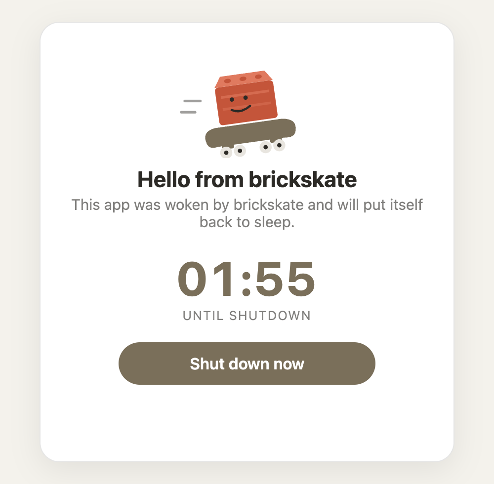

# brickskate example app

A tiny demo Databricks App that brickskate wakes on demand. It says hello,
shows a cheeky brickskate logo, counts down to its own shutdown (180
seconds from the first page view, not from process start, since a wake
itself takes a minute or two), and offers a "Shut down now" button. This app never
talks to Databricks itself; it only asks brickskate to stop it.

<p align="center"></p>

Shutdown path:

button or timer -> POST /api/stop -> POST {BRICKSKATE_URL}/stop -> EventBridge event -> brickskate stop Lambda -> Databricks Apps API stop

## Run locally

From the `example` directory:

```
BRICKSKATE_URL=https://brickskate.haak.au BRICKSKATE_STOP_TOKEN=your-token \
  uvicorn app:app --reload
```

Leave `BRICKSKATE_URL` and `BRICKSKATE_STOP_TOKEN` unset to see the
unconfigured state: the app still runs and counts down, but pressing the
button or letting the timer expire just records that brickskate is not
configured, since there is nothing to call.

## Deploy with the Databricks CLI

Create a secret scope and store the stop token brickskate gave you:

```
databricks secrets create-scope brickskate
databricks secrets put-secret brickskate stop-token --string-value "$TOKEN"
```

Use the same value you stored in SSM for brickskate's `StopTokenParameterName`.

Create the app with the secret wired in as a resource:

```
databricks apps create --json '{"name":"brickskate","resources":[{"name":"stop-token","secret":{"scope":"brickskate","key":"stop-token","permission":"READ"}}]}'
```

The CLI insists on the name being inside the JSON when `--json` is used. In
`app.yaml` the secret arrives as `BRICKSKATE_STOP_TOKEN` via `valueFrom: stop-token`.

Upload the source and deploy:

```
databricks workspace import-dir example /Workspace/Users/<you>/brickskate-example --overwrite
databricks apps deploy brickskate --source-code-path /Workspace/Users/<you>/brickskate-example
```

For brickskate to be able to start and stop this app, its service principal
needs `CAN_MANAGE` on the app and `CAN_READ` on the source folder. The second
one matters because a start redeploys the source as the principal that asked:

```
databricks apps set-permissions brickskate --json '{"access_control_list":[{"service_principal_name":"<client-id-uuid>","permission_level":"CAN_MANAGE"}]}'
DIR_ID=$(databricks workspace get-status /Workspace/Users/<you>/brickskate-example -o json | python3 -c "import json,sys; print(json.load(sys.stdin)['object_id'])")
databricks workspace update-permissions directories "$DIR_ID" --json '{"access_control_list":[{"service_principal_name":"<client-id-uuid>","permission_level":"CAN_READ"}]}'
```

The live copy of this example runs at https://brickskate.haak.au.
